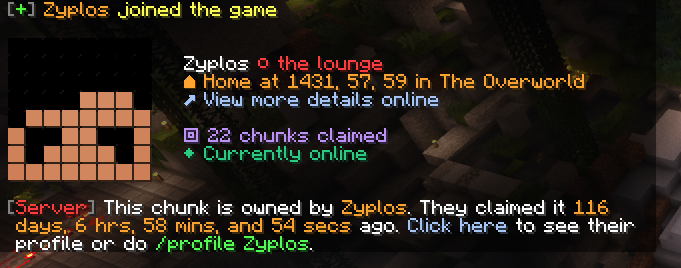

# LoungeCommuna

The ingame Paper plugin used for land claims on the lounge survival Minecraft server. Players can claim chunks, set their home coordinates, and see which players have entered their land claims with an available history log.

Built in Java, this project uses [HikariCP](https://github.com/brettwooldridge/HikariCP) to manage connections and [sql2o](https://github.com/aaberg/sql2o) to easily manage retreieved data.

This plugin requires a MySQL server to be set up and ready. The connection for the server can be configured in the `plugin.yml` file that is generated by Paper in your server's `/plugins/LoungeCommuna/` folder.

The data gathered with this plugin is viewable ingame and on [the lounge's website](https://github.com/Zyplos/lounge-hub). An example can be viewed [on this player profile](https://lounge.haus/mc/player/Zyplos).
